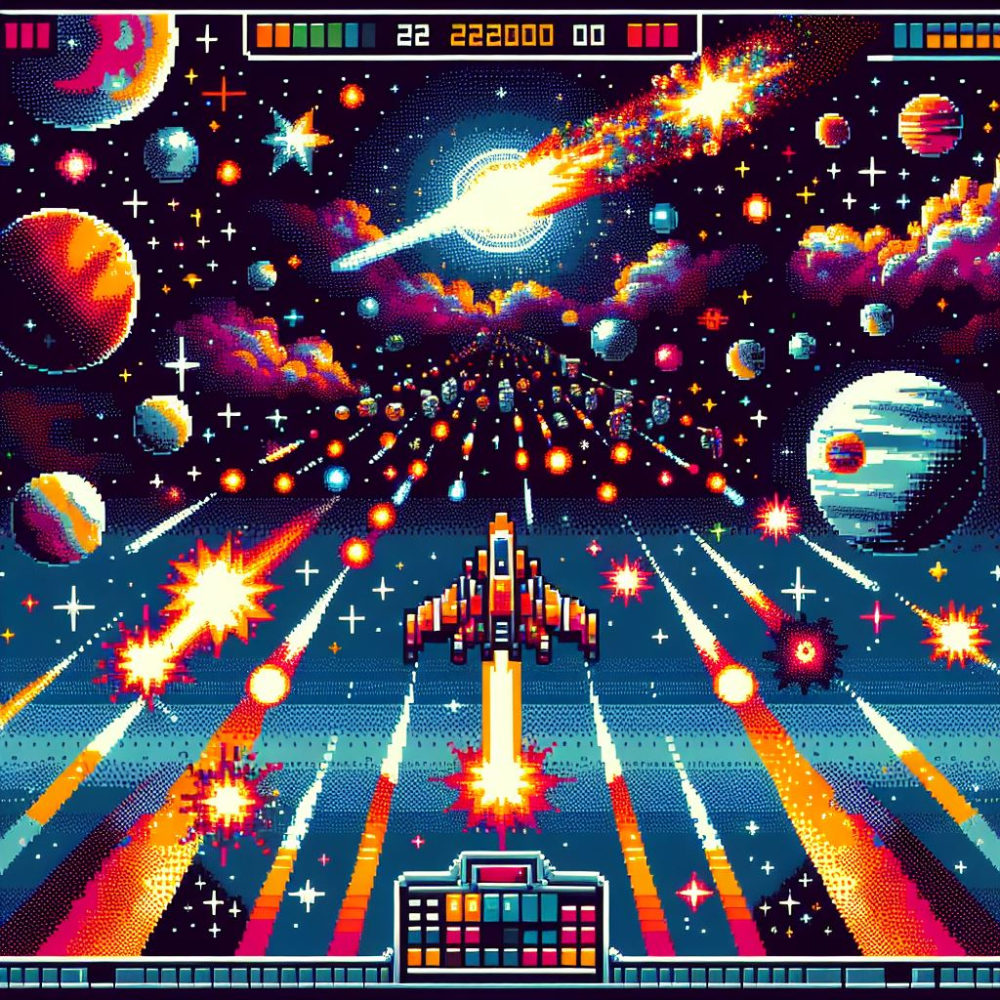
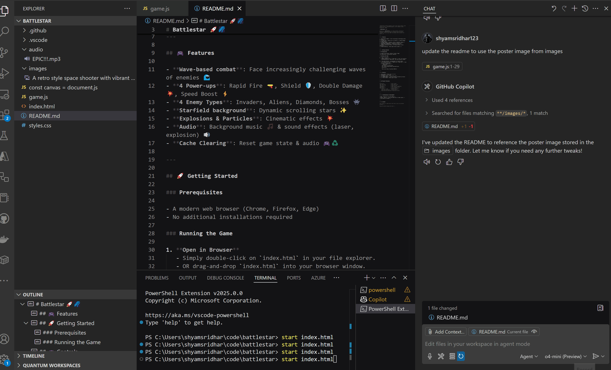

# Battlestar 🚀🌌

Welcome to **Battlestar** — a space shooter inspired by Battlestar Galactica! Engage in endless waves of alien invaders, collect power-ups, and become the ultimate star pilot. 🔥

---

## 🎮 Features

- **Wave-based combat**: Face increasingly challenging waves of enemies 🌊
- **4 Power-ups**: Rapid Fire 🔫, Shield 🛡️, Double Damage 💥, Speed Boost ⚡
- **4 Enemy Types**: Invaders, Aliens, Diamonds, Bosses 👾
- **Starfield background**: Dynamic scrolling stars ✨
- **Explosions & Particles**: Cinematic effects 💥
- **Audio**: Background music 🎵 & sound effects (laser, explosion) 🔊
- **Cache Clearing**: Reset game state & audio 🎮♻️

---

## 🚀 Getting Started

### Prerequisites

- A modern web browser (Chrome, Firefox, Edge)
- No additional installations required

### Running the Game

1. **Open in Browser**
   - Simply double-click on `index.html` in your file explorer.
   - OR drag-and-drop `index.html` into your browser window.

2. **Via Local Server** (recommended for smooth audio)
   - **VS Code Live Server**: Right-click `index.html` → *Open with Live Server* 📡
   - **Node.js HTTP Server**:
     ```powershell
     npm install -g http-server
     cd c:\Users\shyamsridhar\code\battlestar
     http-server
     ```
     Then visit http://localhost:8080 ▶️

---

## 🎮 Controls

- **Arrow Keys**: Move ship (↑ ↓ ← →)
- **Spacebar**: Fire laser
- **🔊 Toggle Music**: Click music icon
- **🔔 Enable Audio**: Click if sound is blocked by browser
- **♻️ Clear Cache**: Reset game & audio

---

## 📁 Project Structure

```
battlestar/               # Root folder
├── index.html            # Main HTML file
├── styles.css            # Game styling
├── game.js               # Game logic & rendering
├── README.md             # This documentation
└── audio/                # Audio assets
    ├── EPIC!!!.mp3       # Background music
    ├── laser-sound.mp3   # Laser effect
    └── explosion-sound.mp3 # Explosion effect
```

---

## 🛠️ Customization & Development

- Edit `styles.css` for UI tweaks 🎨
- Modify `game.js` to add new power-ups or enemy types 🛠️
- Contribute on GitHub! 🌟

---

## 📜 License

This project is open-source and free to use for personal projects. 🚀

Enjoy the battle among the stars! 🌠
